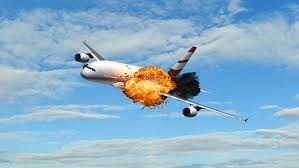

# AN ANALYSIS ON AVIATION ACCIDENTS(1919-2023)

## Overview
This project aims to effectively identify the risks associated with different aircraft by analysing historical aviation accident data. By identifying the patterns, trends, and risk factors that influence aircraft safety, it will facilitate the determination of the lowest risk venture aircraft for purchase by the company and the viable  operation of the aircrafts for commercial and private enterprises. The dataset covers approximately 24,000 aviation accidents worldwide that occurred between 1919 and 2023. Since the company is exploring entry into the aviation sector, it is crucial to understand the historical safety records of different aircraft types, operators, and regions in order to make well-informed decisions.
 

## Business Understanding
The company's goal is not just to diversify its portfolio but also to efficiently identify the risk associated with each aircraft type in order to make well-informed investment decisions for their business endeavour. This lack of clarity on the potential risks involved with an aircraft venture calls for a need to have data-driven insights that would positively lead to optimized decision-making in the critical areas.

To achieve this, the following business questions have been developed:
* Which of the aircraft types contribute the least to aircraft accidents?
* Which locations are performing well, which ones are subject to the most aircraft accidents and what could be the cause?
* Which are the most profitable aircrafts types regardless of the accident frequency and based on accident frequency?
* How are the accidents trending over time e.g. (monthly, quarterly, yearly) and do they have any influx at certain time periods?

## **Data Understanding and Analysis**

### Source of data
The dataset used for this analysis is the [Aviation Accidents Dataset](https://www.kaggle.com/datasets/drealbash/aviation-accident-from-1919-2023/data) that provides a comprehensive record of aircraft accidents that occurred between the years 1919 and 2023. This dataset captures crucial details of each accident, including the date of the incident, registration number of the aircraft involved, the country where the accident occurred, the specific location, the category of the accident, and the number of fatalities. 

### Description of data
The dataset involves the following 9 columns:
* **Date of Accident**: This column contains the dates of each aviation accident, ranging from 1919 to 2023.

* **Type**: This column indicates the model of the aircraft that was involved in the accident. 

* **Registration**: This column contains the unique identification code that is usually assigned to each aircraft. It helps identify and track specific aircraft involved in incidents. 

* **Operator**: This column shows the airline that commands that specific aircraft that was involved in the accident.

* **Fatalities**: This column records the count of fatalities associated with each aviation accident. It provides information on the number of fatalities both ground fatality and aircraft fatality. 

* **Location**: This column shows the specific region within the country where each accident occurred. 

* **Country**: This column indicates the country where each aviation accident took place. This column has no missing values.

* **Cat**: This is short for Category whereby each accident is classified into different categories based on factors such as the cause, nature, or severity of the incident. The categories in the daaset are: 
    * A = Accident

    * I = Incident

    * H = Hijacking

    * C = Criminal occurrence (sabotage, shoot down) O= other occurrence (ground fire, sabotage)

    * U = type of occurrence unknown

    * 1 = hull-loss

    * 2 = repairable damage

    * E.g. the A1 category means an Accident resulting in a total loss of the plane.

* **Year**: This is a column that includes the extracted year-data from the date column. It has no missing values but has them labelled as 'Unknown'.

### Visualizations 
After the data cleaning process, the outcome was this [cleaned dataset](./Data/aviation-accident-data-cleaned.csv). Examining through the tabular structure would prove tiresome hence the nees for visualisations to summarise the key facts and figures. The visuals would not only highlight trends, comparisons and outliers, but also provide an intuitive understanding of the data that might be overlooked in tabular form. This makes it easier to communicate findings on accident frequency, severity and impact across years, aircraft types, and other key dimensions.

* #### Analysing the accidents and fatality trends over time

    Over the entire time period, the higher the accidents yearly, the higher the number of fatalities. However, the accidents and fatalities have both been decreasing proportionally over time to date. 

    Of the top 20 most accident prone models the Douglas model features several times. Specifically, the Douglas C-47A(DC-3) has the most accidents over the time span. It has more than double the second most accident-prone model   

(the same visualizations presented in the slides and notebook)
## **Conclusion**
The decrease in the number of accidents over time has led to a decrease in the number of fatalities. This could be attributed to high technological advancement and improved safety standards in the aviation sector hence less accidents happenning. The company can thus consider it as a wise decision to venture into this industry since it is less prone to accidents hence higher chances of being profitable basing on possibility of accidents occurring.

Since the company wants the least-risk aircraft, they should consider not going for a Douglas Model. This is because historically, this model has been the most accident prone aircrafts hence this doesn't not sit well with the company's goals. This does not mean the other models are safe, but based on historical data, the Douglas are a very risky investment.

Summary of conclusions including three relevant findings